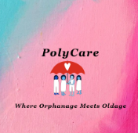

## Overview

**PolyCare**, is the first fully decentralized **charity & fundraising** application which is focused on two main aspects:

1. Bringing **orphanages and oldage homes** together by providing financial assistance to Oldage homes who are willing to provide daycare/childcare services to orphanages.
2. It is also a **Web3 version of https://www.ketto.org/ Web2 platform** where if you have donated to the protocol, you can start a proposal for raising funds for any medical treatment or other causes.

[Video Presentation](here)

## Inspiration

I got my inspiration for this project when I saw a [Linkedin post](https://www.linkedin.com/posts/prerna-goel-038454bb_brilliant-idea-being-implemented-in-canada-activity-6853272506615300096-wIHa?utm_source=linkedin_share&utm_medium=ios_app).
The idea seemed brilliant but at the end of the day to provide childcare service needs financial assistance.
PolyCare aims to provide a platform where you can donate funds and participate in governance to ensure that your funds reaches to the cause that you support.

**Disclaimer** : This project is a proof of concept. The full-blown application is on the roadmap.

## How it works

- Step 1 - Under **Donation** tab - Donate to PolyCare as little as 0.0001 Matic. You can choose if you wish to participate in the Governance Protocol. If yes, you will be minted PolycareToken(PCT) tokens depending upon your donation amount.

- Step 2 - Under **Governance** tab - users with 25000 or more Polycare Tokens can create a proposal (assumption is you or someone you know volunteers and works with the Oldage Homes and Orphanage is your area, determine the expenditure amount and submit proposal with **supporting documents**)
- Step 3 - Proposal goes through governance process where users with PCT token can delegate vote to someone or themself and participate in governance.
- Step 4 - If the proposal is passed, funds are released to the Oldage home.

- Step 5 - Under **PolyCare Statistics** tab - see the latest statistics for total donation amount till date, total balance remaining and total amount released to passed proposals.

- Step 6 - Under **Mint NFT** tab - if you are a donor to PolyCare you can add NFT to the contract which will then be available for minting. Just provide, oraganization name that received the funds, image CID and amount that was donated.

- Step 7 - **Mint SVG NFT** - if you read this far, here is one more surprise for you (kidding). If you donated to the protocol, you can mint 100% on-chain svg badge as token of thank you with the 'Name' of the organization that received the funds by providing the token id.

## How I built it

**PolyCare** is comprised of 5 contracts deployed on the Polygon Mumbai testnet.
This dApp is built on Moralis using features like moralis-react, web3, authentication, event logging, cloud functions, IPFS file save to store and request the token metadata.

PolyCare Architecture

- **Contracts on blockchain**
  The contracts are as below:

  - PolyCareMain : Donation and token contract
  - GovernorContract : Governance contract to create and execute proposals
  - Treasury : PolyCare treasury contract that is being governed via timelock contract
  - PolyCareNFT & PolyCareSVG : For minting NFTs

- **Database**
  To store off-chain data for proposals created and event sync, using Moralis provided mongo-db instance.

- **IPFS/Filecoin**

  - All the NFT images are stored on IPFS/Filecoin
  - The metadata JSON files are uploaded using Moralis saveIPFS() method.

## Challenges I ran into

- The UI developed is by a backend developer attempting front-end so there are still some real-time data display open items that I need to work on.

## Accomplishments that I am proud of

- The idea creation, planning, development and executing it within one month as I participated in the hackathon little late.
- Did 'on-the-job' front-end learning to design my dApp
- Solo developer to build the prototype in a short span

## What I learned

- Learned new solidity concepts for smart contract writing, svg NFTs
- Building a DAO governance protocol
- Beginner level React

**GitHub links**

- PolyCare UI -> https://github.com/ShivaliLN/UI-PolyCare.git
- PolyCare Contracts -> https://github.com/ShivaliLN/PolyCare.git

## Roadmap

- Complete the remaining open items like, dynamic data display
- Plannig to incentivize the proposal creator whoes proposals are passed to keep the motivation going

## Technical details

# Polygon Testnet Deployed Contracts

- Treasury deployed at: https://mumbai.polygonscan.com/address/0x541607EF0081c5A932aE020ABE5da119B9427272
- PolyCareMain deployed at: https://mumbai.polygonscan.com/address/0x0cd73F6cbe32FF4815E6FefF9852907b0Ad1D809
- TimeLock deployed at: https://mumbai.polygonscan.com/address/0xB6d1Bf81a33c8F2A2Ed7Fcda8Cd96059E472528f
- GovernorContract deployed at: https://mumbai.polygonscan.com/address/0x58e332dDA542Fc2CFeB2464e84280d0751779a0e
- NFTContract deployed at: https://mumbai.polygonscan.com/address/0xc791e3E5Ae44172Fe79FF670b1554Ab92160B151
- PolyCareSVG deployed at: https://mumbai.polygonscan.com/address/0xFe5f4b8531C69F2B30388fAaD3dF99a14d0D997b

## DApp hosted here

https://hqxotfxpqma0.usemoralis.com

# Run test from local

    git clone https://github.com/ShivaliLN/PolyCare.git

#

    yarn install
    npx hardhat test
